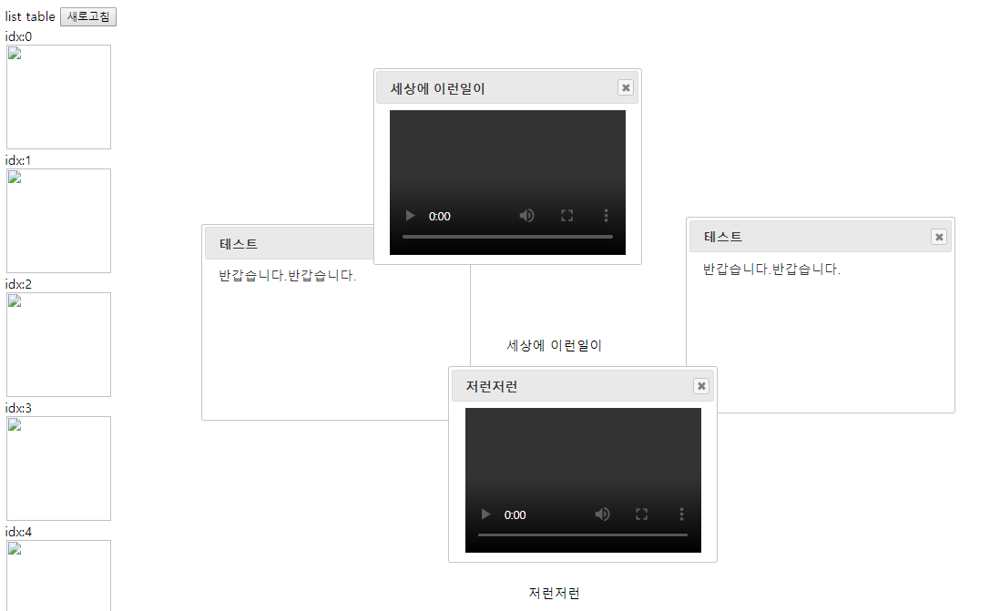
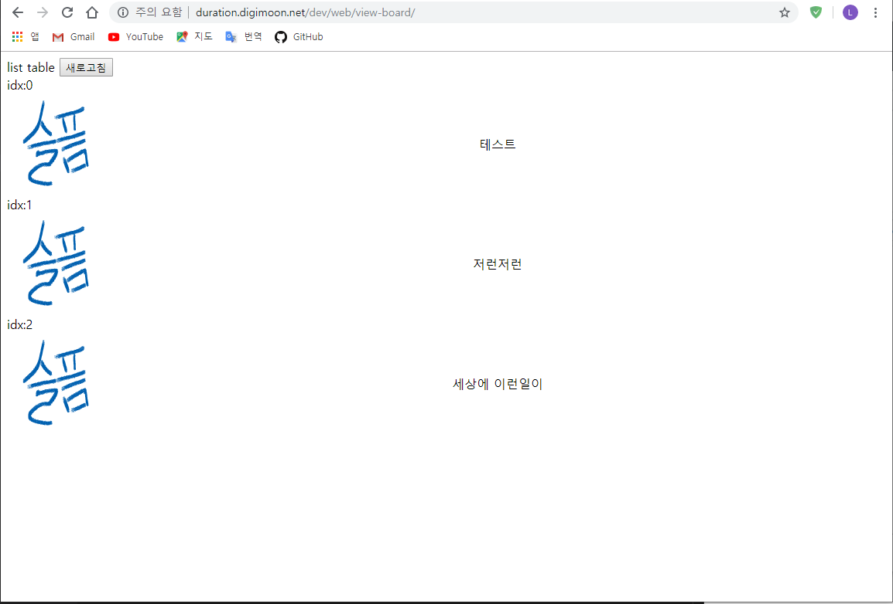
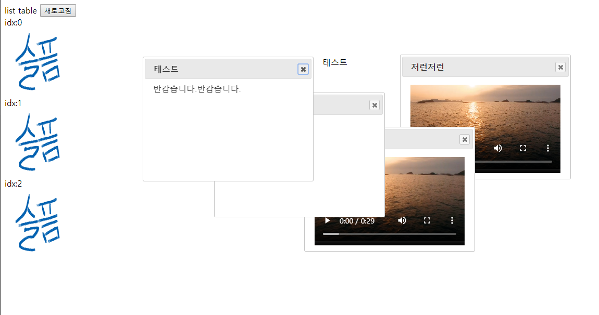
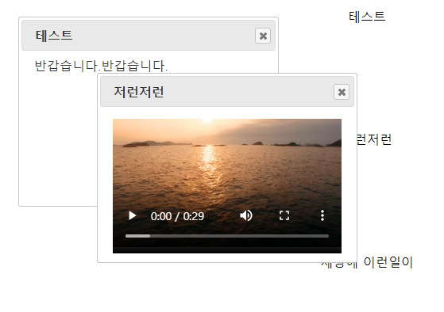

# View Board

View 게시판 :: 동영상, 이미지, 글을 표시하는 게시판

## Preview

- 이 프로젝트의 데모 버전은 [`여기`](http://duration.digimoon.net/dev/web/view-board/)에서 보실 수 있습니다.
  - 해당 페이지에 접속 후 `새로고침` 버튼을 누르시면 됩니다.

## Info

- 게시글을 하나의  팝업으로 표현하는 게시판입니다.

- 같은 게시글이라도 여러개의 `별도의 팝업`으로 표현합니다.

- 동영상, 이미지, 글 하나의 테마로 게시글을 작성할 수 있습니다.

- 각 게시글은 브라우저 내에서 이동할 수 있습니다.

## Finally

- jQuery 및 데이터 파일을 파싱하여 처리하는 방법에 대해 공부하면서 구현된 프로젝트입니다.
- [jQuery UI](https://jqueryui.com/) 라이브러리를 사용하였습니다.

## Modify Content

- 2017.12.262140
  1. 앞으로 파일을 업로드시, 파일 자체를 변이해서 저장하는 방식을 고려, 불러올때 변경하는 download 만들 것.

## Copyright

- 비상업적 용도로 사용 가능하며 `링크`를 반드시 포함해주세요.
- 문제가 되는 내용이 있다면 언제든지 [`issue`](https://github.com/Sotaneum/View-Board/issues/new), [`Pull requests`](https://github.com/Sotaneum/View-Board/compare) 부탁드립니다.
